# Architectural Diagrams: CMF Portal Development Tasks

**Document Version:** 1.0  
**Date:** September 16, 2026  
**Purpose:** Provide visual architectural flows for all 6 development tasks

---

## Table of Contents

1. [AI CMF Recommendation](#1-ai-cmf-recommendation)
2. [Sighting Quality Assessment](#2-sighting-quality-assessment)
3. [Similar Issue Intelligence](#3-similar-issue-intelligence)
4. [AI-Assisted Initial Debug Triage](#4-ai-assisted-initial-debug-triage)
5. [UI Changes](#5-ui-changes)
6. [Aging, Priority and Accountability](#6-aging-priority-and-accountability)

---

## 1. AI CMF Recommendation

### 1.1 Overall System Architecture

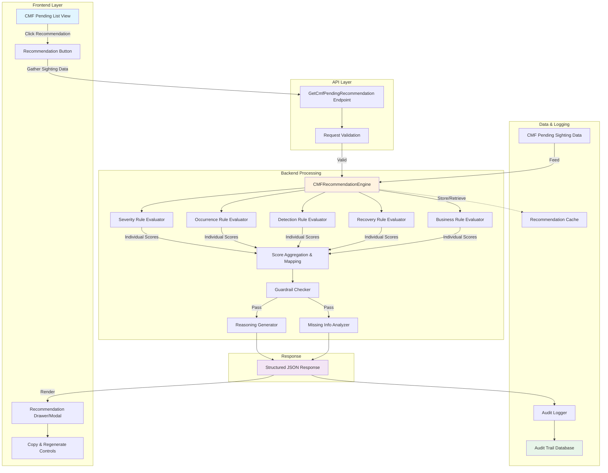

### 1.2 Recommendation Generation Flow

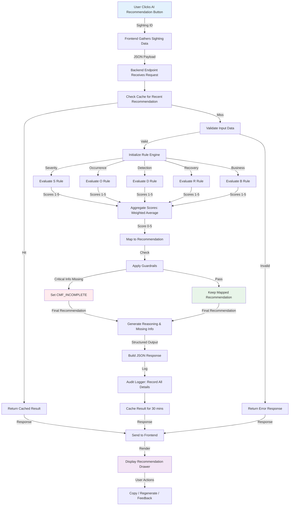

### 1.3 Score Calculation Engine

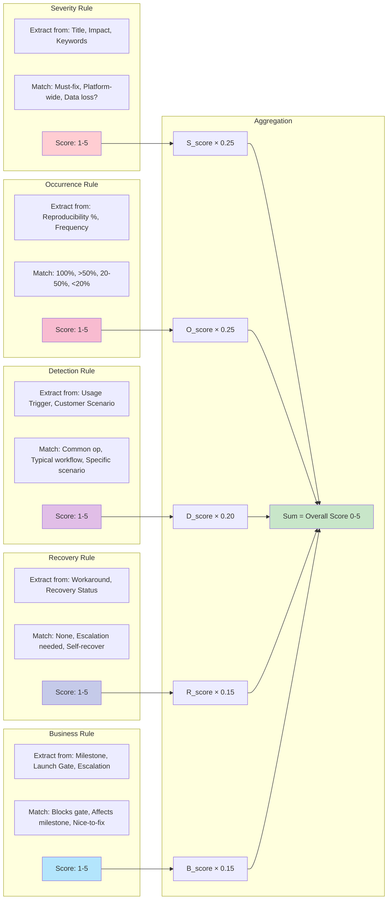

### 1.4 Response Structure

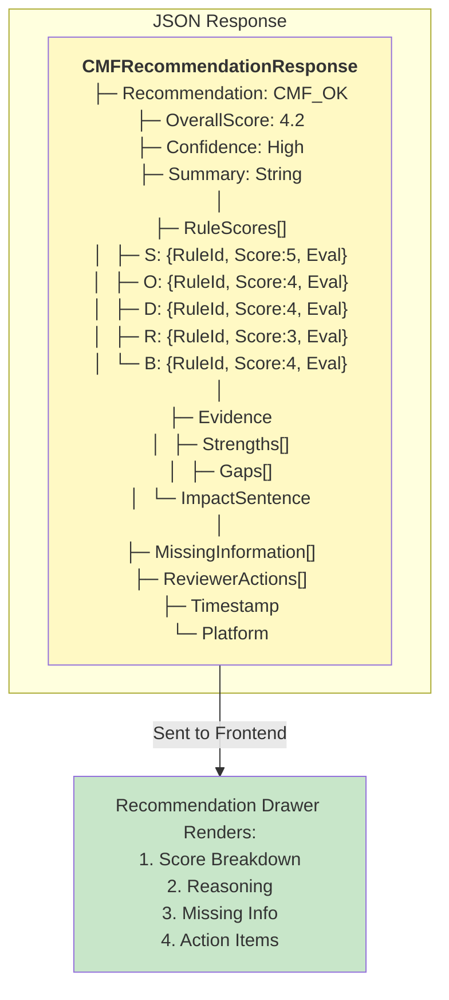

---

## 2. Sighting Quality Assessment

### 2.1 Overall System Architecture

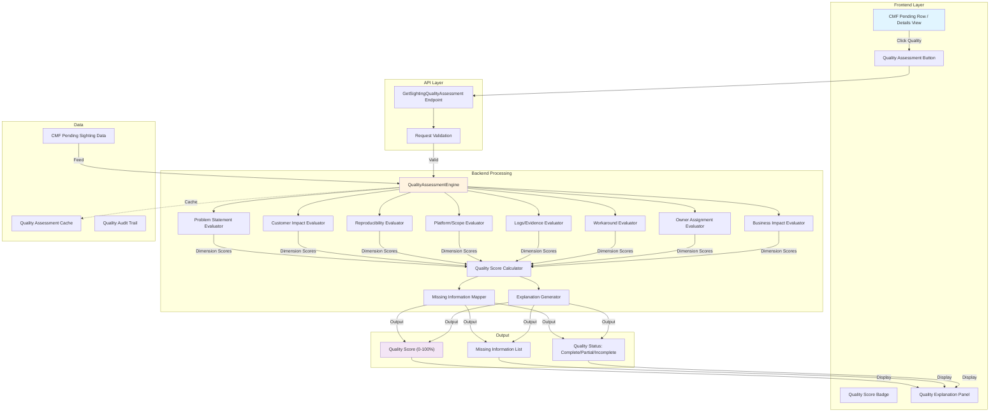

### 2.2 Quality Assessment Flow

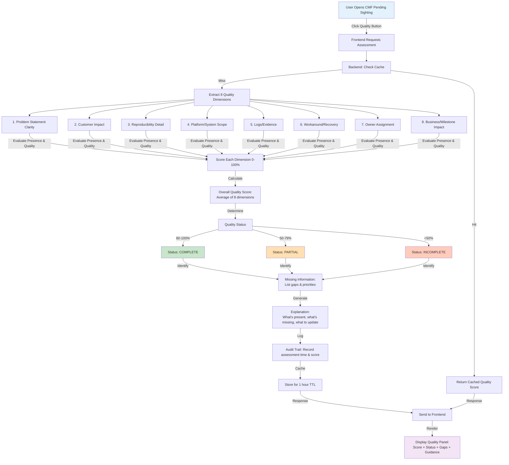

### 2.3 Quality Dimension Scoring

```mermaid
graph TB
    subgraph "Dimension 1: Problem Statement"
        D1A["Present & Clear? ✓"] -->|Yes| D1B["Score: 100%"]
        D1A -->|Vague/Missing| D1C["Score: 20%"]
    end

    subgraph "Dimension 2: Customer Impact"
        D2A["Severity stated? ✓"] -->|Clear| D2B["Score: 100%"]
        D2A -->|Unclear| D2C["Score: 30%"]
    end

    subgraph "Dimension 3: Reproducibility"
        D3A["Rate/Steps provided? ✓"] -->|Yes| D3B["Score: 100%"]
        D3A -->|No| D3C["Score: 20%"]
    end

    subgraph "Dimension 4: Platform Scope"
        D4A["Platform specified? ✓"] -->|Yes| D4B["Score: 100%"]
        D4A -->|No| D4C["Score: 40%"]
    end

    subgraph "Dimension 5: Logs/Evidence"
        D5A["Logs attached? ✓"] -->|Yes| D5B["Score: 100%"]
        D5A -->|No| D5C["Score: 10%"]
    end

    subgraph "Dimension 6: Workaround"
        D6A["Workaround stated? ✓"] -->|Yes| D6B["Score: 100%"]
        D6A -->|No| D6C["Score: 50%"]
    end

    subgraph "Dimension 7: Owner"
        D7A["Owner assigned? ✓"] -->|Yes| D7B["Score: 100%"]
        D7A -->|No| D7C["Score: 0%"]
    end

    subgraph "Dimension 8: Business Impact"
        D8A["Gate/Milestone linked? ✓"] -->|Yes| D8B["Score: 100%"]
        D8A -->|No| D8C["Score: 40%"]
    end

    D1B & D1C & D2B & D2C & D3B & D3C & D4B & D4C & D5B & D5C & D6B & D6C & D7B & D7C & D8B & D8C -->|Average| FINAL["Overall Quality Score"]
    
    FINAL -->|Color-coded| COLOR["🟢 Complete: 80%+<br/>🟡 Partial: 50-79%<br/>🔴 Incomplete: <50%"]

    style COLOR fill:#fff9c4
```

---

## 3. Similar Issue Intelligence

### 3.1 Overall System Architecture

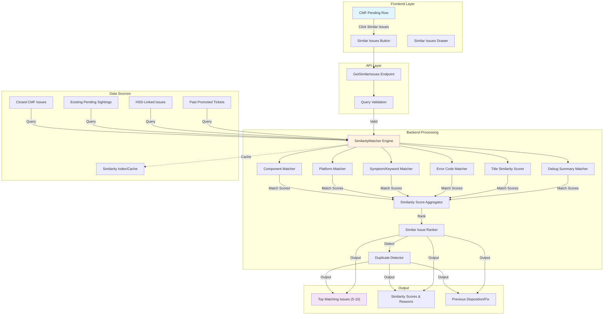

### 3.2 Similar Issue Detection Flow

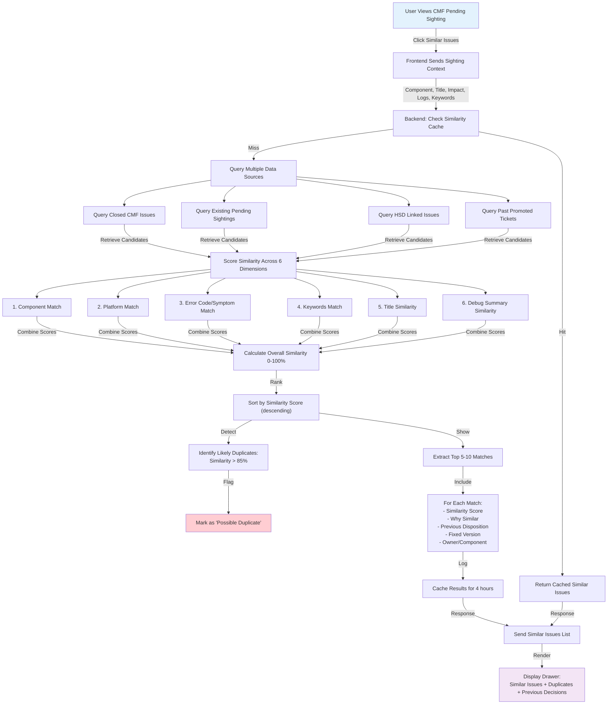

### 3.3 Similarity Matching Logic

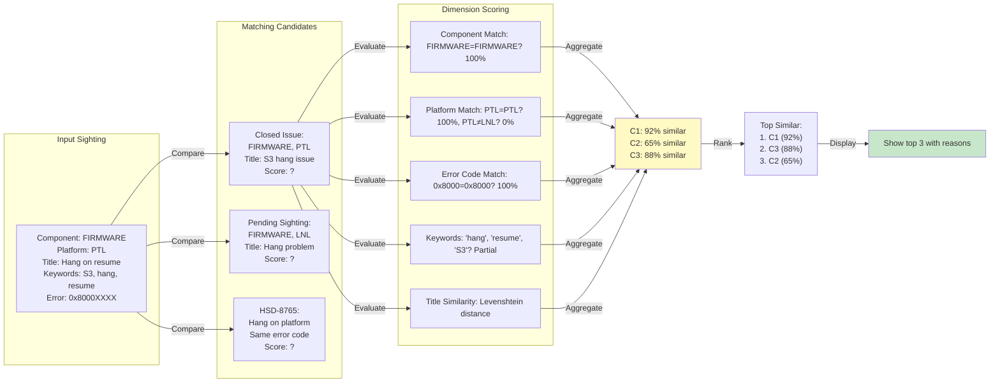

---

## 4. AI-Assisted Initial Debug Triage

### 4.1 Overall System Architecture

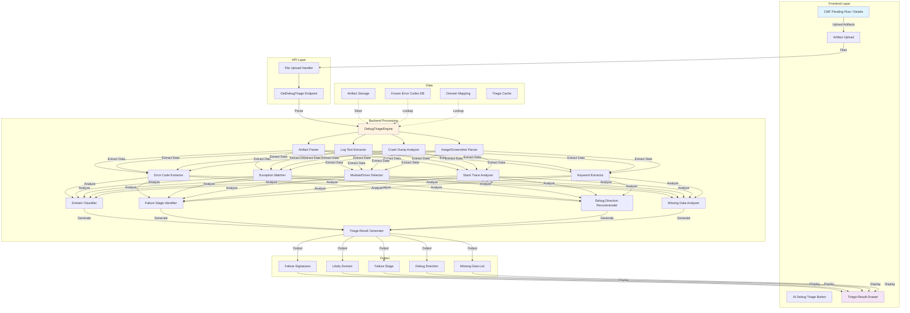

### 4.2 Debug Triage Flow

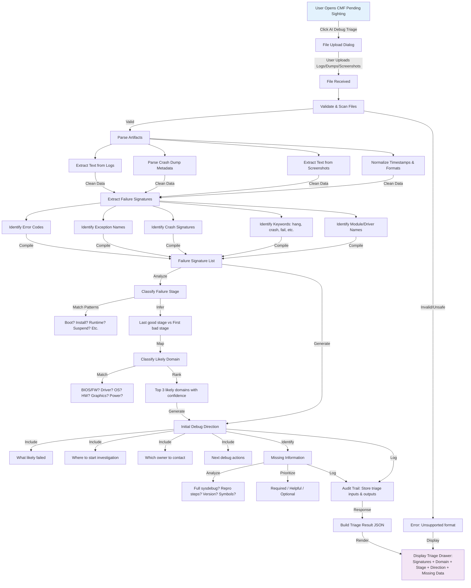

### 4.3 Artifact Analysis Pipeline

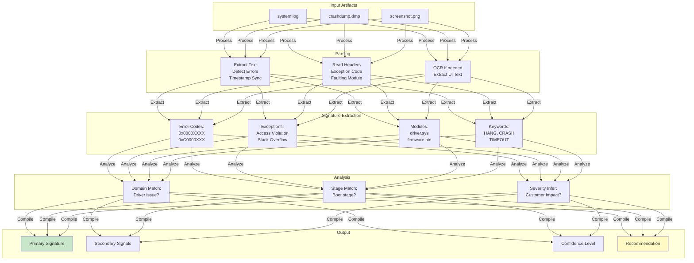

---

## 5. UI Changes

### 5.1 CMF Pending List Layout - Before & After

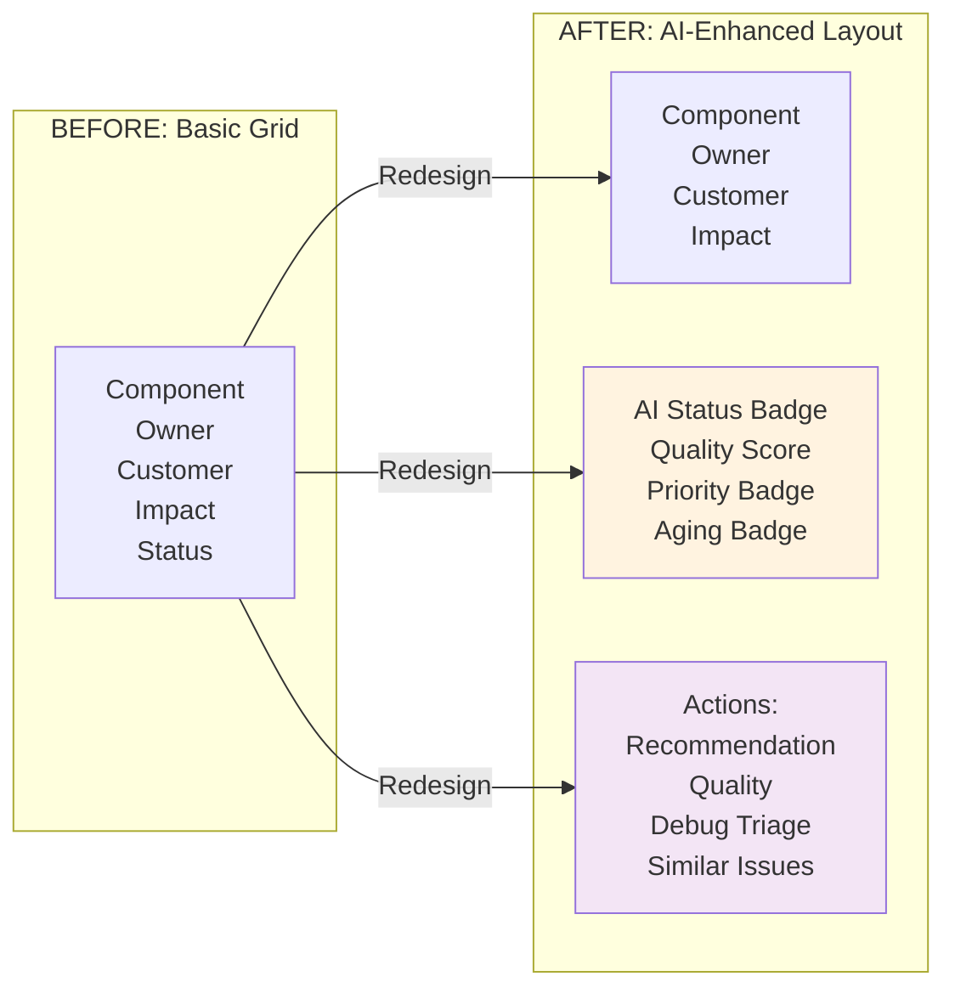

### 5.2 CMF Pending List Component Structure

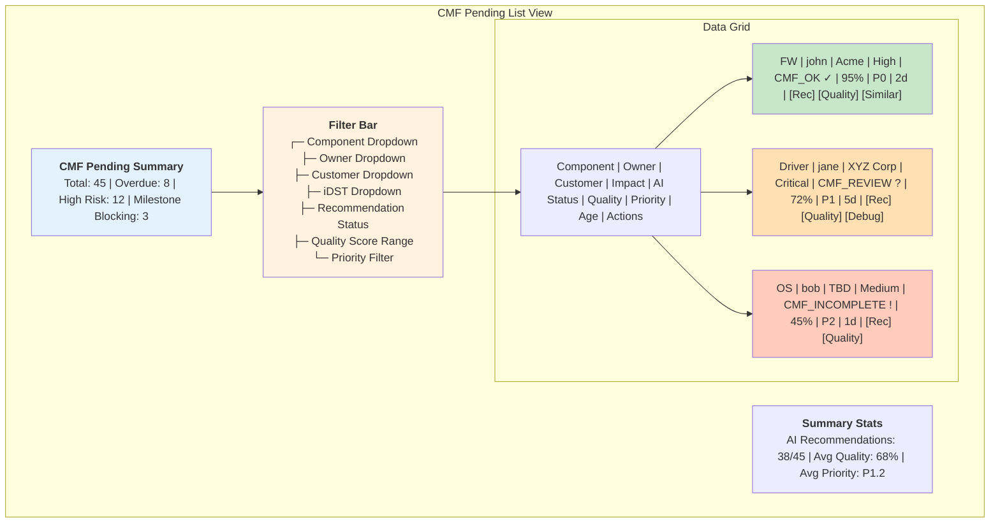

### 5.3 Recommendation Drawer Structure

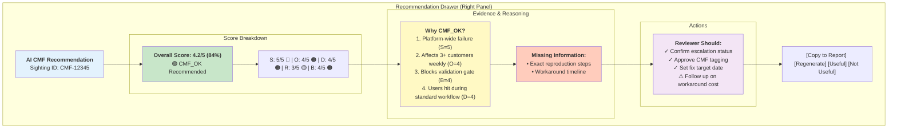

### 5.4 Multi-Drawer Navigation

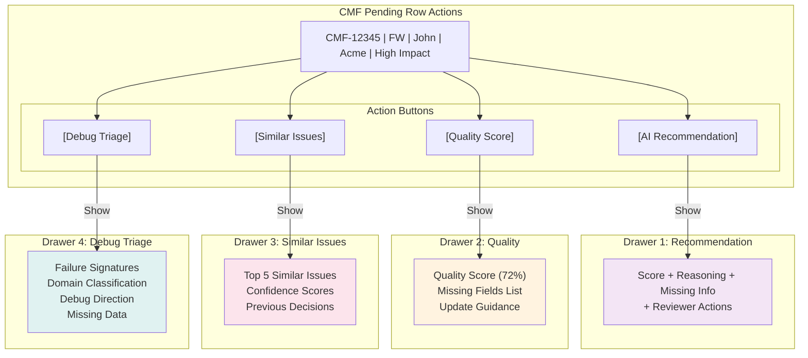

---

## 6. Aging, Priority and Accountability

### 6.1 Overall System Architecture

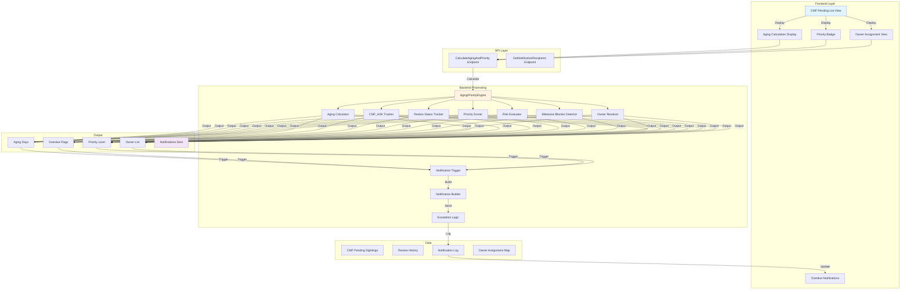

### 6.2 Aging & Priority Calculation Flow

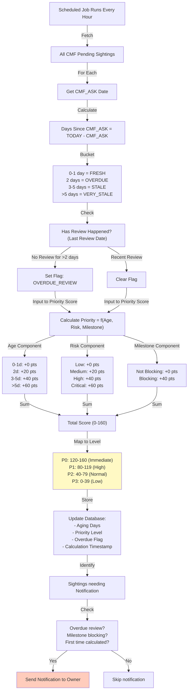

### 6.3 Owner Assignment & Accountability

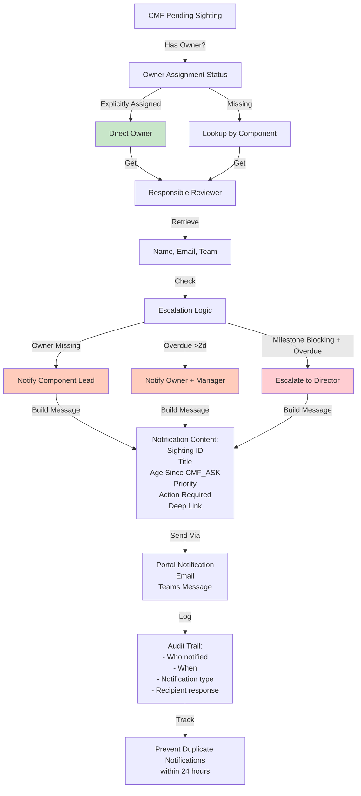

### 6.4 Notification & Escalation Workflow

```mermaid
graph TB
    subgraph "Trigger Events"
        T1["Sighting Created"]
        T2["Sighting Reaches 2 Days Old"]
        T3["Sighting is Milestone Blocking"]
        T4["Manual Escalation"]
    end

    subgraph "Notification Rules"
        R1["New Sighting + Owner Assigned → Notify Owner"]
        R2["Overdue (>2d) + No Review → Notify Owner + Manager"]
        R3["Milestone Blocking + Overdue → Escalate to Director"]
        R4["Missing Owner → Notify Component Lead"]
    end

    subgraph "Escalation Matrix"
        E1["P0 Immediate: Director + VP"]
        E2["P1 High: Manager + Owner"]
        E3["P2 Normal: Owner"]
        E4["P3 Low: Email only"]
    end

    subgraph "Notification Channels"
        C1["Portal In-App Alert"]
        C2["Email"]
        C3["Teams Chat"]
        C4["Dashboard Highlight"]
    end

    T1 & T2 & T3 & T4 -->|Evaluate| R1 & R2 & R3 & R4
    R1 & R2 & R3 & R4 -->|Map Priority| E1 & E2 & E3 & E4
    E1 & E2 & E3 & E4 -->|Route To| C1 & C2 & C3 & C4

    style T1 fill:#e3f2fd
    style T3 fill:#ffccbc
    style E1 fill:#ffcdd2
    style C1 fill:#f3e5f5
```

### 6.5 Dashboard Summary View

```mermaid
graph TB
    subgraph "CMF Pending Dashboard"
        STATS["<b>Summary Statistics</b><br/>Total Pending: 45<br/>Overdue (>2d): 8<br/>Milestone Blocking: 3<br/>Missing Owner: 2"]
        
        subgraph "Age Distribution"
            AGE["0-1 day: 15<br/>2 days: 12 ⚠️<br/>3-5 days: 10 ⚠️<br/>>5 days: 8 🔴"]
        end
        
        subgraph "Priority Queue"
            PRI["P0 (Immediate): 3<br/>P1 (High): 12<br/>P2 (Normal): 20<br/>P3 (Low): 10"]
        end
        
        subgraph "Reviewer Workload"
            WORK["John: 8 items (2 overdue)<br/>Jane: 12 items (3 overdue)<br/>Bob: 6 items (0 overdue)<br/>Unassigned: 19 items"]
        end
        
        subgraph "Overdue Items"
            OVR["CMF-12345 | FW | John | 5 days old 🔴<br/>CMF-12346 | Driver | Jane | 3 days old ⚠️<br/>CMF-12347 | OS | Unassigned | 2 days old ⚠️"]
        end
    end

    STATS --> AGE & PRI & WORK & OVR

    style STATS fill:#e3f2fd
    style AGE fill:#ffebee
    style PRI fill:#fff3e0
    style WORK fill:#e8f5e9
    style OVR fill:#ffccbc
```

---

## Summary: Development Phases & Timeline

```mermaid
graph LR
    subgraph "Phase 1: Foundations (Weeks 1-2)"
        P1A["UI Changes"]
        P1B["Aging/Priority/Accountability"]
    end

    subgraph "Phase 2: Decision Support (Weeks 3-6)"
        P2A["Quality Assessment"]
        P2B["AI CMF Recommendation"]
    end

    subgraph "Phase 3: Intelligence (Weeks 7-10)"
        P3A["Similar Issue Intelligence"]
        P3B["AI Debug Triage"]
    end

    subgraph "Phase 4: Testing & Rollout (Weeks 11-12)"
        P4A["Integration Testing"]
        P4B["User Acceptance Testing"]
        P4C["Production Deployment"]
    end

    P1A & P1B -->|Enable| P2A & P2B
    P2A & P2B -->|Feed| P3A & P3B
    P3A & P3B -->|Validate| P4A
    P4A -->|QA| P4B
    P4B -->|Deploy| P4C

    style P1A fill:#c8e6c9
    style P1B fill:#c8e6c9
    style P2A fill:#fff3e0
    style P2B fill:#fff3e0
    style P3A fill:#fce4ec
    style P3B fill:#fce4ec
    style P4A fill:#f3e5f5
    style P4B fill:#f3e5f5
    style P4C fill:#e0f2f1
```

---

## Key Architectural Principles

### 1. **Modularity**
   - Each feature operates independently with clear interfaces
   - Backend services can be tested in isolation
   - UI components are reusable

### 2. **Caching Strategy**
   - Quality Assessment: 1 hour TTL
   - Recommendation: 30 minutes TTL
   - Similar Issues: 4 hours TTL
   - Aging/Priority: Real-time (hourly job)

### 3. **Audit & Compliance**
   - All AI-generated outputs logged with context
   - User actions tracked for accountability
   - 12-month retention policy

### 4. **Error Handling & Fallbacks**
   - Graceful degradation if service fails
   - Cache fallback when AI service unavailable
   - Clear error messages to users

### 5. **Performance Targets**
   - API responses: <3 seconds (p95)
   - Concurrent users: 50+
   - Database queries: <5ms (audit reports)
   - System uptime: 99.5%

---

**End of Architecture Diagrams Document**
